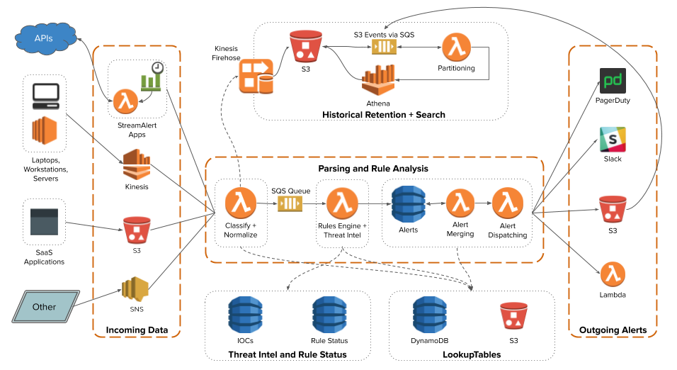

############
Architecture
############
StreamAlert consists of multiple AWS components connected together and managed by Terraform.

  (click to enlarge)

**************
Data Lifecycle
**************
1. Log data can come through any of the supported `data sources <datasources.html>`_.
This includes Kinesis, S3, SNS, or using a `StreamAlert App <app-configuration.html>`_ to periodically
poll data from a third-party API.

2. Inbound logs are first ingested via the "classifier" Lambda function in one of your
`clusters <clusters.html>`_. The classifier is the first and most substantial component of
StreamAlert, responsible for parsing, classifying, and performing normalization on logs.
The classifier(s) can also optionally forward the resulting logs from classification to Firehose
for historical retention and searching via `Athena <athena-overview.html>`_. The same results
also get sent to an SQS Queue for further downstream analysis.

3. The SQS Queue that the classifier function(s) send data to is then utilized by a "rules engine"
Lambda function. Note that this function is **not** "clustered" like the classifier(s) and is global
to the StreamAlert deployment. The data read from the queue will be ran through the defined rules,
and any alerts that are triggered will be sent to a DynamoDB table. Optionally, the rules engine
function can read Threat Intelligence information from DynamoDB, or perform other lookup-style
operations using data stored in S3.

4. The "alert merger" Lambda function regularly scans the alerts DynamoDB table. When new alerts
arrive, they are either forwarded immediately (by default) or, if merge options are specified, they
are bundled together with similar alerts before proceeding to the next stage.

5. The "alert processor" Lambda function is responsible for actually delivering the alert to its
configured `outputs <outputs.html>`_. All alerts implicitly include a Firehose output, which feeds
an S3 bucket that can be queried with Athena. Alerts will be retried indefinitely until they are
successfully delivered, at which point they will be removed from the DynamoDB table.

6. An Athena Partitioner Lambda function runs periodically to onboard new StreamAlert data
and alerts into their respective Athena databases for historical search.

Other StreamAlert components include DynamoDB tables and Lambda functions for optional rule
promotion and regularly updating threat intelligence information.
