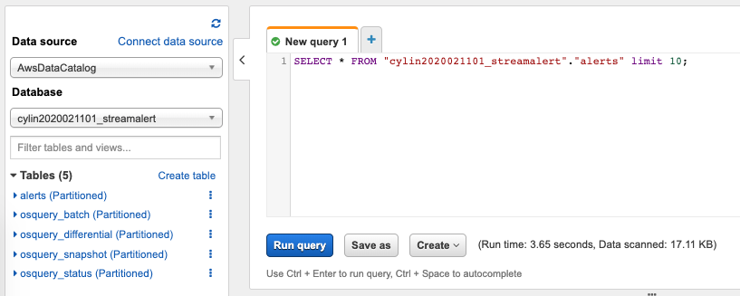

###############
Getting Started
###############
It only takes a few minutes to get StreamAlert up and running! These instructions have been tested
on MacOS, but should also work on most linux systems.

********************
Install Dependencies
********************

1. Install Python 3.7 and `pip <https://pip.pypa.io/en/stable/installing/>`_
2. Install `Terraform <https://www.terraform.io/intro/getting-started/install.html>`_ >= v0.13.0:

.. code-block:: bash

  brew install terraform  # MacOS Homebrew
  terraform --version     # Must be >= v0.13.0

.. note::

  Terraform versions lower than 0.13 are not supported. We recommend installing Terraform
  version 0.13.0 or greater.

3. If you are using Linux, you may need to install the Python development libraries:

.. code-block:: bash

  sudo apt install python-dev    # Debian
  sudo yum install python-devel  # CentOS/RHEL

********************
Download StreamAlert
********************
1. Clone the latest stable release of StreamAlert:

.. code-block:: bash

  git clone --branch stable https://github.com/airbnb/streamalert.git

2. Create and activate a virtual environment:

.. code-block:: bash

  cd streamalert
  python3.9 -m venv venv
  source venv/bin/activate

3. Install the StreamAlert requirements:

.. code-block:: bash

  pip install -r requirements.txt

4. Run unit tests to make sure everything is installed correctly:

.. code-block:: bash

  tests/scripts/unit_tests.sh

*************************
Configure AWS Credentials
*************************
1. Create an AWS account and an `IAM user <https://docs.aws.amazon.com/IAM/latest/UserGuide/id_users_create.html>`_
with permissions for at least the following services:

* Athena
* CloudTrail
* CloudWatch Events and Logs
* DynamoDB
* Glue
* IAM
* Kinesis Firehose and Streams
* KMS
* Lambda
* S3
* SNS
* SQS

2. Configure your AWS credentials

.. code-block:: bash

  pip install --user awscli
  aws configure

******
Deploy
******
.. note:: StreamAlert supports Terraform's native ability to lock the remote s3 state file whenever a user is planning and applying Terraform configuration.
    This is to prevent multiple users from deploying StreamAlert at the same time potentially resulting in a broken state.
    StreamAlert will automatically create and destroy this table via the command line interface.
    See `Terraform's documentation <https://www.terraform.io/docs/backends/types/s3.html>`_ for more information.

1. Set basic StreamAlert configuration options:

.. code-block:: bash

  python manage.py configure aws_account_id 111111111111  # Replace with your 12-digit AWS account ID
  python manage.py configure prefix <value>               # Choose a unique name prefix (alphanumeric characters only)

  .. code-block:: bash

    "athena_partitioner_config": {
      "concurrency_limit": 10,
      "file_format": "parquet",
      "log_level": "info"
    }

  * More information can be found on the `historical search <historical-search.html>`_ page.

2. Build the StreamAlert infrastructure for the first time:

.. code-block:: bash

  python manage.py init

There will be multiple Terraform prompts, type "yes" at each one to continue.

.. note:: You only need to ``python manage.py init`` once for any given StreamAlert deployment,
   although it is safe to run again if necessary.

3. At this point, StreamAlert is up and running! You can, for example, see the S3 buckets
that were automatically created:

.. code-block:: bash

  aws s3 ls | grep streamalert

You can also login to the AWS web console and see StreamAlert's CloudWatch logs, Lambda functions, etc.

*********
Live Test
*********
Now let's upload some data and trigger an alert to see StreamAlert in action! This example uses
SNS for both sending the log data and receiving the alert, but StreamAlert also supports many other
`data sources <datasources.html>`_ and `alert outputs <outputs.html>`_.

1. Create 2 SNS topics:

.. code-block:: bash

  aws sns create-topic --name streamalert-test-data
  aws sns create-topic --name streamalert-test-alerts

2. Export some environment variables for easy re-use later:

.. code-block:: bash

  export SA_REGION=us-east-1        # StreamAlert deployment region
  export SA_ACCOUNT=111111111111    # AWS account ID
  export SA_EMAIL=email@domain.com  # Email to receive an SNS notification

3. Subscribe your email to the alerts SNS topic:

.. code-block:: bash

  aws sns subscribe --topic-arn arn:aws:sns:$SA_REGION:$SA_ACCOUNT:streamalert-test-alerts \
      --protocol email --notification-endpoint $SA_EMAIL

.. note:: You will need to click the verification link in your email to activate the subscription.

4. Add the ``streamalert-test-data`` SNS topic as an input to the (default) ``prod`` `cluster <config-clusters.html>`_.
Open ``conf/clusters/prod.json`` and change the ``streamalert`` module to look like this:

.. code-block:: json

  {
    "classifier_config": {
      "enable_custom_metrics": true,
      "inputs": {
        "aws-sns": [
          "arn:aws:sns:REGION:ACCOUNTID:streamalert-test-data"
        ]
      },
      "log_level": "info",
      "log_retention_days": 14,
      "memory": 128,
      "timeout": 60
    }
  }

5. Tell StreamAlert which `log schemas <config-schemas.html>`_ will be sent to this input.
Open ``conf/clusters/prod.json`` and change the ``data_sources`` section to look like this:

.. code-block:: json

  {
    "data_sources": {
      "sns": {
        "streamalert-test-data": [
          "cloudwatch"
        ]
      }
    }
  }

6. Add the alert topic as a StreamAlert output:

.. code-block:: bash

  python manage.py output set aws-sns

  Please supply a short and unique descriptor for this SNS topic: test-email

  Please supply SNS topic name: streamalert-test-alerts

If you look at ``conf/outputs.json``, you'll notice that the SNS topic was automatically added.

7. Configure a rule to send to the alerts topic.
We will use ``rules/community/cloudwatch_events/cloudtrail_root_account_usage.py`` as an example, which
alerts on any usage of the root AWS account. Change the rule decorator to:

.. code-block:: python

  @rule(
      logs=['cloudwatch:events'],
      req_subkeys={'detail': ['userIdentity', 'eventType']},
      outputs=['aws-sns:test-email']  # Add this line
  )
  def cloudtrail_root_account_usage(rec):

8. Now we need to update StreamAlert with these changes:

.. code-block:: bash

  # Hook the streamalert-test-data SNS topic up to the StreamAlert Classifier function
  python manage.py build

  # Deploy a new version of all of the Lambda functions with the updated rule and config files
  python manage.py deploy

.. note:: Use ``build`` and ``deploy`` to apply any changes to StreamAlert's
   configuration or Lambda functions, respectively. Some changes (like this example) require both.

9. Time to test! Create a file named ``cloudtrail-root.json`` with the following contents:

.. code-block:: json

  {
    "account": "1234",
    "detail": {
      "eventType": "AwsConsoleSignIn",
      "userIdentity": {
        "type": "Root"
      }
    },
    "detail-type": "CloudTrail Test",
    "id": "1234",
    "region": "us-east-1",
    "resources": [],
    "source": "1.1.1.2",
    "time": "now",
    "version": "2018"
  }

This is only a rough approximation of what the real log might look like, but good enough for our purposes.
Then send it off to the data SNS topic:

.. code-block:: bash

  aws sns publish --topic-arn arn:aws:sns:$SA_REGION:$SA_ACCOUNT:streamalert-test-data \
      --message "$(cat cloudtrail-root.json)"

If all goes well, an alert should arrive in your inbox within a few minutes!
If not, look for any errors in the CloudWatch Logs for the StreamAlert Lambda functions.

10. After 10 minutes (the default refresh interval), the alert will also be searchable from
`Amazon Athena <https://console.aws.amazon.com/athena>`_. Select your StreamAlert database in the
dropdown on the left and preview the ``alerts`` table:

(Here, my name prefix is ``testv2``.) If no records are returned, look for errors
in the Athena Partitioner function or try invoking it directly.

And there you have it! Ingested log data is parsed, classified, and scanned by the rules engine.
Any resulting alerts are delivered to your configured output(s) within a matter of minutes.
