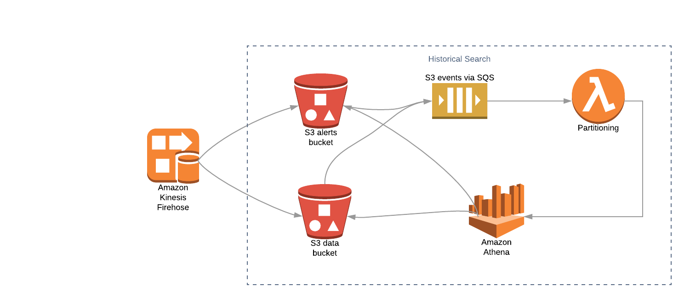

.. _historical_search:

Historical Search
#################

StreamAlert historical search feature is backed by Amazon S3 and `Athena <https://aws.amazon.com/athena/>`_ services. By default, StreamAlert will send all alerts to S3 and those alerts will be searchable in Athena table. StreamAlert users have option to enable historical search feature for data as well.

As of StreamAlert v3.1.0, a new field, ``file_format``, has been added to ``athena_partition_refresh_config`` in ``conf/lamba.json``, defaulting to ``null``. This field allows users to configure how the data processed by the Classifier is stored in S3 bucket—either in ``parquet`` or ``json``. Prior to v3.1.0, all data was stored in ``json``. When using this format, Athena's search performance degrades greatly when partition sizes grow. To address this, we've introduce support for ``parquet`` to provide better Athena search performance and cost saving.

.. note::

  * When upgrading StreamAlert to v3.1.0, it is required to change the default ``file_format`` value to either ``parquet`` or ``json``, otherwise StreamAlert will raise ``MisconfigurationError`` exception when run ``python manage.py build``.
  * For existing deployments, ``file_format`` can be set to ``json`` and there will have no change occurred. However, if the ``file_format`` is changed to ``parquet``, all Athena tables need to be created to load ``parquet`` format. The existing JSON data won't be searchable anymore unless we build a separated tables to process data in JSON format. (All data stay in S3 bucket, there is no data loss.).
  * For new StreamAlert deployments, it is recommended to set ``file_format`` to ``parquet`` to take the advantage of better Athena search performance and save the cost when scanning data.
  * In the future release, the default value of ``file_format`` will change to ``parquet``. So let's change now!

************
Architecture
************

The pipeline is
* StreamAlert creates an Athena Database, alerts kinesis Firehose and ``alerts`` table during initial deployment
* Optional to create Firehose and Athena tables for data
* S3 events will be sent to SQS to invoke ``athena_partition_refresh`` lambda function to add new partitions when there are new alerts or data saved in S3 bucket via Firehose
* New alerts and data are available for searching via Athena console or SDK

.. _alerts_search:

*************
Alerts Search
*************

* Review alert Firehose configuration, see :ref:`alerts_firehose_configuration` in ``CONFIGURATION`` session. Athena database and Athena alerts table are created automatically when you first deploy StreamAlert.
* If the ``file_format`` is set to ``parquet``, you can run ``MSCK REPAIR TABLE alerts`` command in the Athena to load all available partitions and then alerts can be searchable. However, using ``MSCK REPAIR`` command can not load new partitions automatically.
* StreamAlert provides a lambda function ``athena_partition_refresh`` to load new partitions to Athena tables once the data arrives in the S3 buckets automatically. Update ``athena_partition_refresh_config`` if necessary. Open ``conf/lambda.json``. See more settings :ref:`configure_athena_partition_refresh_lambda`

  .. code-block:: bash

    {
      "athena_partition_refresh_config": {
        "concurrency_limit": 10,
        "file_format": "parquet",
        "log_level": "info"
      }
    }

* Deploy athena_partition_refresh lambda function

  .. code-block:: bash

    python manage.py deploy --function athena

* Search alerts in `Athena Console <https://console.aws.amazon.com/athena>`_

  * Choose your ``Database`` from the dropdown on the left. Database name is ``<prefix>_streamalert``
  * Write SQL query statement in the ``Query Editor`` on the right

  .. image:: ../images/athena-alerts-search.png

***********
Data Search
***********

It is optional to store data in S3 bucket and available for search in Athena tables.

* Enable Firehose in ``conf/global.json`` see :ref:`firehose_configuration`
* Build the Firehose and Athena tables

  .. code-block:: bash

    python manage.py build

* Deploy classifier so classifier will know to send data to S3 bucket via Firehose

  .. code-block:: bash

    python manage.py deploy --function classifier

* Search data `Athena Console <https://console.aws.amazon.com/athena>`_

  * Choose your ``Database`` from the dropdown on the left. Database name is ``<prefix>_streamalert``
  * Write SQL query statement in the ``Query Editor`` on the right

  .. image:: ../images/athena-data-search.png

.. _configure_athena_partition_refresh_lambda:

*************************
Configure Lambda Settings
*************************

Open ``conf/lambda.json``, and fill in the following options:

===================================  ========  ====================   ===========
Key                                  Required  Default                Description
-----------------------------------  --------  --------------------   -----------
``enabled``                          Yes       ``true``               Enables/Disables the Athena Partition Refresh Lambda function
``enable_custom_metrics``            No        ``false``              Enables/Disables logging of metrics for the Athena Partition Refresh Lambda function
``log_level``                        No        ``info``               The log level for the Lambda function, can be either ``info`` or ``debug``.  Debug will help with diagnosing errors with polling SQS or sending Athena queries.
``memory``                           No        ``128``                The amount of memory (in MB) allocated to the Lambda function
``timeout``                          No        ``60``                 The maximum duration of the Lambda function (in seconds)
``file_format``                      Yes       ``null``               The alerts and data format stored in S3 bucket via Firehose, can be either ``parquet`` (preferred) or ``json``
``buckets``                          No        ``{}``                 Key value pairs of S3 buckets and associated Athena table names.  By default, the alerts bucket will exist in each deployment.
===================================  ========  ====================   ===========

**Example:**

.. code-block:: json

  {
    "athena_partition_refresh_config": {
      "log_level": "info",
      "memory": 128,
      "buckets": {
        "alternative_bucket": "data"
      },
      "file_format": "parquet",
      "timeout": 60
    }
  }

*****************
Athena References
*****************

* `Introduction to SQL <https://www.w3schools.com/sql/sql_intro.asp>`_
* `Amazon Athena Getting Started <https://docs.aws.amazon.com/athena/latest/ug/getting-started.html>`_
* `Presto Documenation <https://prestodb.io/docs/0.172/index.html#>`_

.. tip::

  * Alerts and data are partitioned by ``dt`` in the format ``YYYY-MM-DD-hh``
  * To improve query performance, filter data within a specific partition or range of partitions

    .. code-block:: sql

      SELECT * FROM "<prefix>_streamalert"."alerts"
      WHERE dt BETWEEN 2020-02-28-00 AND 2020-02-29-00
