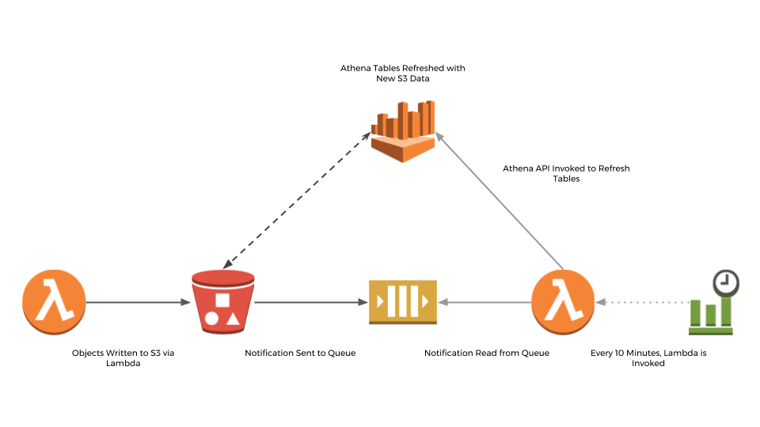
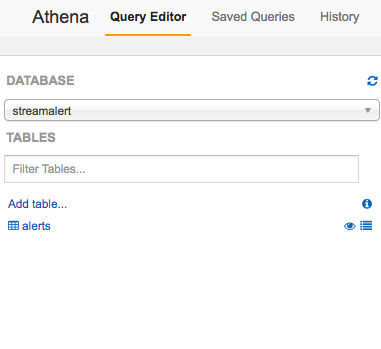
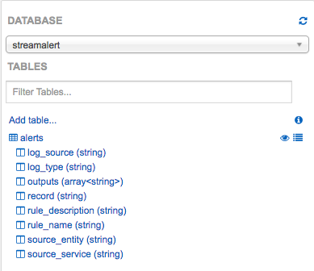
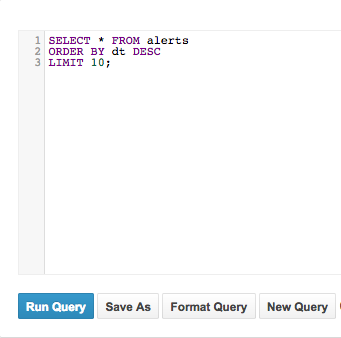

#################
Historical Search
#################

The historical data retention and search feature in StreamAlert is backed by Amazon Athena and S3.
Amazon Athena is a serverless query service used to analyze large volumes of data stored in S3.

Data in Athena is searchable via ANSI SQL and powered by Presto.

StreamAlert uses Amazon Athena for historical searching of:

* Generated alerts from StreamAlert, enabled within StreamAlert out of the box
* All incoming log data sent to StreamAlert, configurable after StreamAlert initialization

This works by:

* Creating a ``streamalert`` Athena database
* Creating Athena tables to read S3 data
* Using a Lambda function to periodically refresh Athena to make the data searchable

****************
General Concepts
****************
* `Amazon Athena details <https://aws.amazon.com/athena/details/>`_
* `Amazon Athena tables <http://docs.aws.amazon.com/athena/latest/ug/creating-tables.html>`_
* `AWS Lambda FAQ <https://aws.amazon.com/athena/faqs/>`_
* `AWS Lambda pricing <https://aws.amazon.com/athena/pricing/>`_

***************
Getting Started
***************
Searching of alerts is enabled within StreamAlert out of the box, and can be further extended to search all incoming log data.

To create tables for searching data sent to StreamAlert, run:

.. code-block:: bash

  $ python manage.py athena create-table \
    --bucket <prefix>-streamalert-data \
    --table-name <log_name>

The log name above reflects an enabled log type in your StreamAlert deployment. These are also top level keys in the various files under the ``schemas`` directory.

For example, if you have 'cloudwatch' in your sources, you would want to create tables for all possible subtypes.  This includes ``cloudwatch:control_message``, ``cloudwatch:events``, and ``cloudwatch:flow_logs``. The ``:`` character is not an acceptable character in table names due to a Hive limitation, but your arguments can be either ``cloudwatch:events`` **or** ``cloudwatch_events``. Both will be handled properly by StreamAlert.

Repeat this process for all relevant data tables in your deployment.

Deploying
=========
Once the options above are set, deploy the infrastructure with the following commands:

.. code-block:: bash

  $ python manage.py build
  $ python manage.py deploy --function classifier

*******************
Athena Architecture
*******************
The Athena Partition Refresh function exists to periodically refresh Athena tables, enabling the searchability of alerts and log data.

The default refresh interval is 10 minutes but can be configured by the user.

Concepts
========
The Athena Partition Refresh function utilizes:

* `Amazon S3 Event Notifications <http://docs.aws.amazon.com/AmazonS3/latest/dev/NotificationHowTo.html>`_
* `Amazon SQS <https://aws.amazon.com/sqs/details/>`_
* `AWS Lambda Invocations by Schedule <http://docs.aws.amazon.com/lambda/latest/dg/tutorial-scheduled-events-schedule-expressions.html>`_
* `Amazon Athena Repair Table <https://docs.aws.amazon.com/athena/latest/ug/msck-repair-table.html>`_

Diagram
-------

Internals
---------
Each time the Athena Partition Refresh Lambda function is invoked, it does the following:

* Polls the SQS queue for the latest S3 event notifications (up to 100)
* S3 event notifications contain context around any new object written to a data bucket (as configured below)
* A set of unique S3 Bucket IDs is deduplicated from the notifications
* Queries Athena to verify the ``streamalert`` database exists
* Refreshes the Athena tables for data in the relevant S3 buckets, as specified below in the list of ``buckets``
* Deletes messages off the queue once partitions are created

Configure Lambda Settings
=========================
Open ``conf/lambda.json``, and fill in the following options:

===================================  ========  ====================   ===========
Key                                  Required  Default                Description
-----------------------------------  --------  --------------------   -----------
``enabled``                          Yes       ``true``               Enables/Disables the Athena Partition Refresh Lambda function
``enable_custom_metrics``            No        ``false``              Enables/Disables logging of metrics for the Athena Partition Refresh Lambda function
``log_level``                        No        ``info``               The log level for the Lambda function, can be either ``info`` or ``debug``.  Debug will help with diagnosing errors with polling SQS or sending Athena queries.
``memory``                           No        ``128``                The amount of memory (in MB) allocated to the Lambda function
``timeout``                          No        ``60``                 The maximum duration of the Lambda function (in seconds)
``schedule_expression``              No        ``rate(10 minutes)``   The rate of which the Athena Partition Refresh Lambda function is invoked in the form of a `CloudWatch schedule expression <http://amzn.to/2u5t0hS>`_.
``buckets``                          Yes       ``{}``                 Key value pairs of S3 buckets and associated Athena table names.  By default, the alerts bucket will exist in each deployment.
===================================  ========  ====================   ===========

**Example:**

.. code-block:: json

  {
    "athena_partition_refresh_config": {
      "log_level": "info",
      "memory": 128,
      "buckets": {
        "alternative_bucket": "data"
      },
      "...": "...",
      "timeout": 60
    }
  }

Deployment
==========
If any of the settings above are changed from the initialized defaults, the Lambda function will need to be deployed in order for them to take effect:

.. code-block:: bash

  $ python manage.py deploy --function athena

Going forward, if the deploy flag ``--function all`` is used, it will redeploy this function along with the ``rule`` function and ``alert`` function.

Monitoring
----------
To ensure the function is operating as expected, monitor the following SQS metrics for ``<prefix>_streamalert_athena_s3_notifications``:

* ``NumberOfMessagesReceived``
* ``NumberOfMessagesSent``
* ``NumberOfMessagesDeleted``

All three of these metrics should have very close values.

If the ``NumberOfMessagesSent`` is much higher than the other two metrics, the ``schedule_expression`` should be increased in the configuration.

For high throughput production environments, an interval of 1 to 2 minutes is recommended.

*****************
Athena User Guide
*****************

Concepts
========
* `SQL <https://www.w3schools.com/sql/sql_intro.asp>`_
* `Athena Partitions <http://docs.aws.amazon.com/athena/latest/ug/partitions.html>`_

Querying Data
=============
All alerts generated by StreamAlert will be sent to an ``alerts`` S3 bucket via Firehose. These will then be searchable within Athena.

To get started with querying of this data, navigate to the AWS Console, click Services, and type 'Athena'.

When the service loads, switch the ``DATABASE`` option in the dropdown to ``streamalert``:

To view the schema of the ``alerts`` table, click the eye icon:

To make a query, type a SQL statement in the Query Editor, and click Run Query:

The query shown above will show the most recent 10 alerts.

Tips
====
Data is partitioned in the following format ``YYYY-MM-DD-hh-mm``.

An example is ``2017-08-01-22-00``.

To increase query performance, filter data within a specific partition or range of partitions.

With StreamAlert tables, the date partition is the ``dt`` column.

As an example, the query below counts all alerts during a given minute:

.. figure:: ../images/athena-usage-4.png
  :alt: StreamAlert Athena Run Query with Partition
  :align: center
  :target: _images/athena-usage-4.

For additional guidance on using SQL, visit the link under Concepts.
