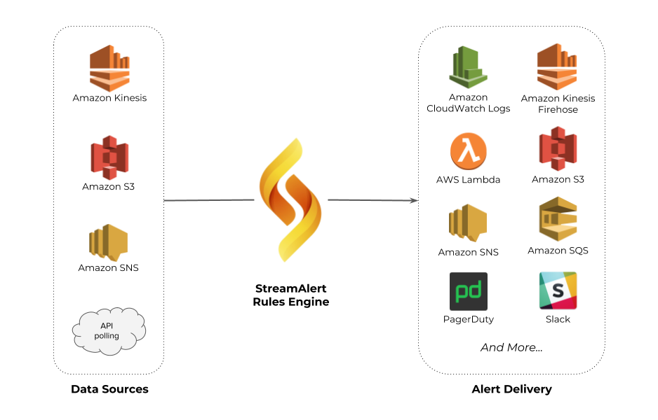

########
Overview
########
StreamAlert is a serverless, real-time data analysis framework which empowers you to ingest,
analyze, and alert on data from any environment, using data sources and alerting logic you define.
Computer security teams use StreamAlert to scan terabytes of log data every day for incident
detection and response.

Incoming log data will be classified and processed by the rules engine. Alerts are then sent
to one or more outputs.

  (click to enlarge)

********
Features
********
* Rules are written in Python; they can utilize any Python libraries or functions
* Ingested logs and generated alerts can be retroactively searched for compliance and research
* Serverless design is cheaper, easier to maintain, and scales to terabytes per day
* Deployment is automated: simple, safe and repeatable for any AWS account
* Secure by design: least-privilege execution, containerized analysis, and encrypted data storage
* Merge similar alerts and automatically promote new rules if they are not too noisy
* Built-in support for dozens of log types and schemas
* Built-in collection of broadly applicable community rules
* Fully open source and customizable: add your own log schemas, rules, and alert outputs

Ready? Let's `get started! <getting-started.html>`_

*********
Resources
*********
* `Blog Post <https://medium.com/@airbnbeng/e8619e3e5043>`_
* `GitHub <https://github.com/airbnb/streamalert>`_
* `Slack (unofficial) <https://streamalert.herokuapp.com>`_

*****************
Table of Contents
*****************

.. toctree::
   :maxdepth: 2
   :caption: Introduction

   getting-started
   architecture
   datatypes
   datasources

.. toctree::
  :maxdepth: 2
  :caption: Configuration

  config-global
  config-clusters
  config-schemas

.. toctree::
   :maxdepth: 2
   :caption: User Guide

   deployment
   rules
   testing
   outputs
   dynamic-outputs
   publishers
   lookup-tables
   apps
   metrics
   rule-staging
   rule-promotion
   historical-search
   scheduled-queries
   normalization
   conf-schemas-examples
   troubleshooting
   faq
   alternatives
