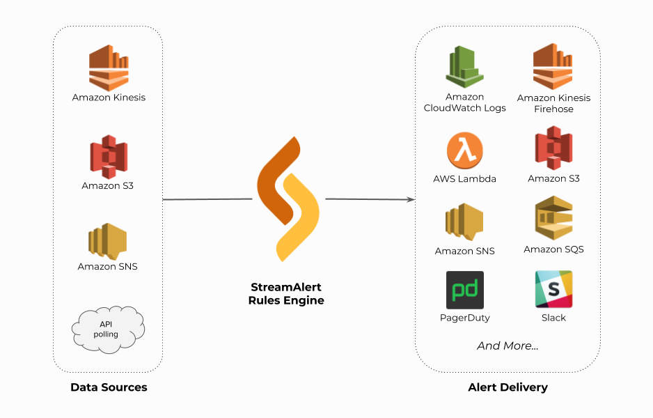

StreamAlert
===========

StreamAlert is a serverless, real-time data analysis framework which empowers you to ingest, analyze, and alert on data from any environment, using data sources and alerting logic you define.
Computer security teams use StreamAlert to scan terabytes of log data every day for incident detection and response.

Overview
--------
Incoming log data is classified and scanned by the StreamAlert rules engine running in your AWS account.
Rule matches are reported to one or more alert outputs:

  (Click to enlarge)

Features
--------

* Rules are written in Python; they can utilize any Python libraries or functions
* Ingested logs and generated alerts can be retroactively searched for compliance and research
* Serverless design is cheaper, easier to maintain, and scales to terabytes per day
* Deployment is automated: simple, safe and repeatable for any AWS account
* Secure by design: least-privilege execution, containerized analysis, and encrypted data storage
* Merge similar alerts and automatically promote new rules if they are not too noisy
* Built-in support for dozens of log types and schemas
* Built-in collection of broadly applicable community rules
* Fully open source and customizable: add your own log schemas, rules, and alert outputs

Ready? Let's `get started! <getting-started.html>`_

Resources
-----------

* `Blog Post <https://medium.com/@airbnbeng/e8619e3e5043>`_
* `GitHub <https://github.com/airbnb/streamalert>`_
* `Slack (unofficial) <https://streamalert.herokuapp.com>`_

Table of Contents
=================

.. _introduction:

.. toctree::
   :maxdepth: 2
   :caption: Introduction

   getting-started
   architecture

.. _data_configuration:

.. toctree::
   :maxdepth: 2
   :caption: Data Ingestion

   clusters
   datatypes
   datasources
   conf-datasources
   conf-schemas
   conf-schemas-examples

.. _user_guide:

.. toctree::
   :maxdepth: 2
   :caption: User Guide

   deployment
   rules
   testing
   outputs
   publishers
   metrics
   troubleshooting
   faq
   alternatives

.. _historical_search:

.. toctree::
  :maxdepth: 2
  :caption: Historical Search

  athena-overview
  athena-arch
  athena-user-guide
  firehose

.. _rule_staging_and_promotion:

.. toctree::
  :maxdepth: 2
  :caption: Rule Staging and Promotion

  rule-staging
  rule-promotion

.. toctree::
  :maxdepth: 2
  :caption: StreamAlert Apps

  app-configuration
  app-auth-update
  app-development
