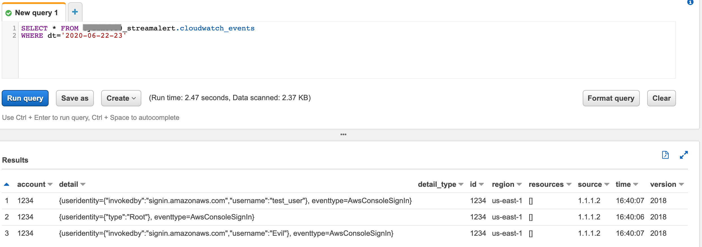
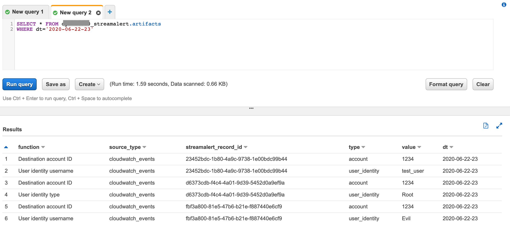

#############
Normalization
#############

StreamAlert has an unannounced feature Data Normalization. In its current implementation, it extracts recognized field names from classified records, and saves them to a top-level key on the same record.

This is useful for rules, as they can be written to compare data fields against IoCs, such as IP Address, instead of writing one rule for each incoming data type. However, there are couple limitations we have identified as we use Normalization internally for a while.

**************************
Normalization 2.0 (Reboot)
**************************

In Normalization 2.0, we introduce a new lambda function ``Artifact Extractor`` by leveraging `Amazon Kinesis Data Firehose Data Transformation <https://docs.aws.amazon.com/firehose/latest/dev/data-transformation.html>`_ feature to extract interesting artifacts from records processed by classifiers. The artifacts will be stored in the same S3 bucket where StreamAlert `Historical Search <historical-search.html>`_ feature uses and the Artifacts will be available for searching via Athena as well.

Artifacts Inventory
===================

An artifact is any field or subset of data within a record that bears meaning beyond the record itself, and is of interest in computer security. For example, a “carbonblack_version” would not be an artifact, as it is meaningless outside of the context of Carbon Black data. However, an ``ip_address`` would be an artifact.

``Artifact Extractor`` Lambda function will build an artifacts inventory based on S3 and Athena services. It enables users to search for all artifacts across whole infrastructure from a single Athena table.

Architecture
============

.. figure:: ../images/normalization-arch.png
  :alt: Normalization V2 Architecture
  :align: center
  :target: _images/normalization-arch.png

  (click to enlarge)

Configuration
=============
In Normalization v1, the normalized types are based on log source (e.g. osquery, cloudwatch, etc) and defined in ``conf/normalized_types.json`` file.

In Normalization v2, the normalized types will be based on log type (e.g. osquery:differential, cloudwatch:cloudtrail, cloudwatch:events, etc) and defined in ``conf/schemas/*.json``. Although, it is recommended to configure normalization in ``conf/schemas/*.json``, the v1 configuration will be still valid and merged to v2.

Giving some examples to configure normalization v2. All normalized types are arbitrary, but we recommend to use all lower cases and underscores to name the normalized types to have better compatibility with Athena.

* Normalized all ip addresses (``ip_address``) and user identities (``user_identity``) for ``cloudwatch:events`` events

  ``conf/schemas/cloudwatch.json``

  .. code-block::

    "cloudwatch:events": {
      "schema": {
        "account": "string",
        "detail": {},
        "detail-type": "string",
        "id": "string",
        "region": "string",
        "resources": [],
        "source": "string",
        "time": "string",
        "version": "string"
      },
      "parser": "json",
      "configuration": {
        "normalization": {
          "event_name": [
            "eventName"
          ],
          "account": [
            {
              "fields": ["account"],
              "function": "Source account ID"
            },
            {
              "fields": ["recipientAccountId"],
              "function": "Destination account ID"
            }
          ],
          "ip_address": [
            {
              "fields": [
                "source",
                "sourceIPAddress"
              ],
              "function": "Source IP addresses"
            },
            {
              "fields": [
                "destination"
              ],
              "function": "Destination IP addresses"
            }
          ],
          "user_agent": [
            "userAgent"
          ],
          "user_identity": [
            "userName",
            "owner",
            "invokedBy",
            "type"
          ]
        }
      }
    }

* Normalized all commands (``command``) and user identities (``user_identity``) for ``osquery:differential`` events

  ``conf/schemas/osquery.json``

  .. code-block::

    "osquery:differential": {
      "schema": {
        "action": "string",
        "calendarTime": "string",
        "columns": {},
        "counter": "integer",
        "decorations": {},
        "epoch": "integer",
        "hostIdentifier": "string",
        "log_type": "string",
        "name": "string",
        "unixTime": "integer",
        "logNumericsAsNumbers": "string",
        "numerics": "string"
      },
      "parser": "json",
      "configuration": {
        "optional_top_level_keys": [
          "counter",
          "decorations",
          "epoch",
          "log_type",
          "logNumericsAsNumbers",
          "numerics"
        ],
        "normalization": {
          "command": [
            "cmdline",
            "command"
          ],
          "ip_address": [
            {
              "fields": [
                "host",
                "source",
                "local_address",
                "address"
              ],
              "function": "Source IP addresses"
            },
            {
              "fields": [
                "destination",
                "remote_address",
                "gateway"
              ],
              "function": "Destination IP addresses"
            }
          ],
          "user_identity": [
            "username",
            "user"
          ]
        }
      }
    }

Deployment
==========

* Artifact Extractor will only work if firehose and historical search enabled in ``conf/global.json``

  .. code-block::

    "infrastructure": {
      ...
      "firehose": {
        "use_prefix": true,
        "buffer_interval": 60,
        "buffer_size": 128,
        "enabled": true,
        "enabled_logs": {
          "cloudwatch": {},
          "osquery": {}
        }
      }
      ...
    }

* Enable Artifact Extractor feature in ``conf/lambda.json``

  .. code-block::

    "artifact_extractor_config": {
      "concurrency_limit": 10,
      "enabled": true,
      ...
    },

* Use StreamAlert cli to deploy Artifact Extractor lambda function and new resources

  The deployment will add following resources.

  * A new Lambda function
  * A new Glue catalog table ``artifacts`` for Historical Search via Athena
  * A new Firehose to deliver artifacts to S3 bucket
  * Update existing Firehoses to allow to invoke Artifact Extractor lambda if it is enabled on the Firehoses
  * New permissions, metrics and alarms.

  .. code-block:: bash

    python manage.py deploy --function artifact_extractor

* If normalization configuration changed in ``conf/schemas/*.json``, make sure deploy classifier as well

  .. code-block:: bash

    python manage.py deploy --function classifier

Artifacts
=========

Artifacts will be searching via Athena ``artifacts`` table. During the test in staging environment, two fake ``cloudwatch:events`` were sent to a Kinesis data stream.

Those two fake events were searchable in ``cloudwatch_events`` table.

  (click to enlarge)

Artifacts extracted from those two fake events were searchable in ``artifacts`` table.

  (click to enlarge)

**************
Considerations
**************

The Normalization Reboot will bring us good value in terms of how easy will be to search for artifacts across entire infrastructure in the organization. It will also make it possible to write more efficient scheduled queries to have correlated alerting in place. But, it is worth to mention that there may have some tradeoffs on requiring additional resources, adding additional data delay.

#. Increase in Data Footprint: Each individual original record has the chance to add many artifacts. In practice, this will likely not be a huge issue as each artifact is very small and only contains few fields.

#. Additional Delay: Firehose data transformation will add additional up to 900 seconds of delay on the data available for historical search. 900 seconds is a configurable setting on the Firehose where the artifacts extracted from. Reduce the firehose buffer_interval value if want to reduce delay.

#. High memory usage: Artifact Extractor Lambda function may need at least 3x max(buffer size of firehoses where the artifacts extracted from). Because we are doing lots of data copy in Artifact Extractor lambda function. This may be improved by writing more efficient code in the Artifact Extractor Lambda function..
