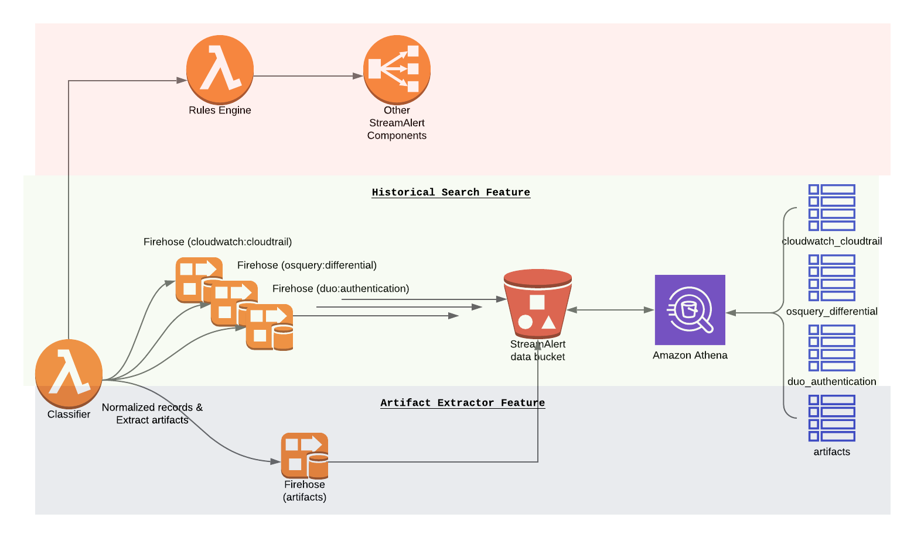

#############
Normalization
#############

StreamAlert has an unannounced feature Data Normalization. In its current implementation, it extracts recognized field names from classified records, and saves them to a top-level key on the same record.

This is useful for rules, as they can be written to compare data fields against IoCs, such as IP Address, instead of writing one rule for each incoming data type. However, there are couple limitations we have identified as we use Normalization internally for a while.

**************************
Normalization 2.0 (Reboot)
**************************

In Normalization 2.0, we introduce a new lambda function ``Artifact Extractor`` by leveraging `Amazon Kinesis Data Firehose Data Transformation <https://docs.aws.amazon.com/firehose/latest/dev/data-transformation.html>`_ feature to extract interesting artifacts from records processed by classifiers. The artifacts will be stored in the same S3 bucket where StreamAlert `Historical Search <historical-search.html>`_ feature uses and the Artifacts will be available for searching via Athena as well.

Artifacts Inventory
===================

An artifact is any field or subset of data within a record that bears meaning beyond the record itself, and is of interest in computer security. For example, a “carbonblack_version” would not be an artifact, as it is meaningless outside of the context of Carbon Black data. However, an ``ip_address`` would be an artifact.

``Artifact Extractor`` Lambda function will build an artifacts inventory based on S3 and Athena services. It enables users to search for all artifacts across whole infrastructure from a single Athena table.

Architecture
============

  (click to enlarge)

Configuration
=============
In Normalization v1, the normalized types are based on log source (e.g. ``osquery``, ``cloudwatch``, etc) and defined in ``conf/normalized_types.json`` file.

In Normalization v2, the normalized types will be based on log type (e.g. ``osquery:differential``, ``cloudwatch:cloudtrail``, ``cloudwatch:events``, etc) and defined in ``conf/schemas/*.json``. Please note, ``conf/normalized_types.json`` will is deprecated.

All normalized types are arbitrary, but only lower case alphabetic characters and underscores should be used for names in order to be compatible with Athena.

Supported normalization configure syntax:

  .. code-block::

    "cloudwatch:events": {
      "schema": {
        "field1": "string",
        "field2": "string",
        "field3": "string"
      },
      "parser": "json",
      "configuration": {
        "normalization": {
          "normalized_key_name1": [
            {
              "path": ["path", "to", "original", "key"],
              "function": "The purpose of normalized_key_name1",
              "condition": {
                "path": ["path", "to", "other", "key"],
                "is|is_not|in|not_in|contains|not_contains": "string or a list"
              },
              "send_to_artifacts": true|false
            }
          ]
        }
      }
    }

* ``normalized_key_name1``: An arbitrary string to name the normalized key, e.g. ``ip_address``, ``hostname``, ``command`` etc.
* ``path``: A list contains a json path to the original key which will be normalized.
* ``function``: Describe the purpose of the normalizer.
* ``condition``: An optional block that is executed first. If the condition is not met, then this normalizer is skipped.

  * ``path``: A list contains a json path to the condition key.
  * ``is|is_not|in|not_in|contains|not_contains``: Exactly one of these fields must be provided. This is the value that the conditional field that is compared against. E.g

    .. code-block::

      "condition": {
        "path": ["account"],
        "is": "123456"
      }

      "condition": {
        "path": ["detail", "userIdentity", "userName"],
        "in": ["root", "test_username"]
      }

    .. note::

      Use all lowercases string a list of strings in the conditional field. The value from the record will be converted to all lowercases.

* ``send_to_artifacts``: A boolean flag indicates should normalized information sent to ``artifacts`` table. This field is optional and it is default to ``true``. It thinks all normalized information are artifacts unless set this flag to ``false`` explicitly.

Below are some example configurations for normalization v2.

* Normalize all ip addresses (``ip_address``) and user identities (``user_identity``) for ``cloudwatch:events`` logs

  ``conf/schemas/cloudwatch.json``

  .. code-block::

    "cloudwatch:events": {
      "schema": {
        "account": "string",
        "detail": {},
        "detail-type": "string",
        "id": "string",
        "region": "string",
        "resources": [],
        "source": "string",
        "time": "string",
        "version": "string"
      },
      "parser": "json",
      "configuration": {
        "normalization": {
          "ip_address": [
            {
              "path": [
                "detail",
                "sourceIPAddress"
              ],
              "function": "Source IP addresses"
            }
          ],
          "user_identity": [
            {
              "path": ["detail", "userIdentity", "type"],
              "function": "User identity type",
              "send_to_artifacts": false
            },
            {
              "path": ["detail", "userIdentity", "arn"],
              "function": "User identity arn"
            },
            {
              "path": ["detail", "userIdentity", "userName"],
              "function": "User identity username"
            }
          ]
        }
      }
    }

* Normalize all commands (``command``) and file paths (``file_path``) for ``osquery:differential`` logs

  ``conf/schemas/osquery.json``

  .. code-block::

    "osquery:differential": {
      "schema": {
        "action": "string",
        "calendarTime": "string",
        "columns": {},
        "counter": "integer",
        "decorations": {},
        "epoch": "integer",
        "hostIdentifier": "string",
        "log_type": "string",
        "name": "string",
        "unixTime": "integer",
        "logNumericsAsNumbers": "string",
        "numerics": "string"
      },
      "parser": "json",
      "configuration": {
        "optional_top_level_keys": [
          "counter",
          "decorations",
          "epoch",
          "log_type",
          "logNumericsAsNumbers",
          "numerics"
        ],
        "normalization": {
          "command": [
            {
              "path": ["columns", "command"],
              "function": "Command line from shell history"
            }
          ],
          "file_path": [
            {
              "path": ["columns", "history_file"],
              "function": "Shell history file path"
            }
          ]
        }
      }
    }

* Normalize username (``user_identity``) for ``cloudwatch:events`` logs when certain condition is met. In the following example, it will only normalize username related to AWS accounts ``11111111`` and ``22222222``.

  ``conf/schemas/cloudwatch.json``

  .. code-block::

    "cloudwatch:events": {
      "schema": {
        "account": "string",
        "detail": {},
        "detail-type": "string",
        "id": "string",
        "region": "string",
        "resources": [],
        "source": "string",
        "time": "string",
        "version": "string"
      },
      "parser": "json",
      "configuration": {
        "normalization": {
          "user_identity": [
            {
              "path": ["detail", "userIdentity", "userName"],
              "function": "User identity username",
              "condition": {
                "path": ["account"],
                "in": ["11111111", "22222222"]
              }
            }
          ]
        }
      }
    }

Deployment
==========

* Artifact Extractor will only work if Firehose and Historical Search are enabled in ``conf/global.json``

  .. code-block::

    "infrastructure": {
      ...
      "firehose": {
        "use_prefix": true,
        "buffer_interval": 60,
        "buffer_size": 128,
        "enabled": true,
        "enabled_logs": {
          "cloudwatch": {},
          "osquery": {}
        }
      }
      ...
    }

* Enable Artifact Extractor feature in ``conf/global.json``

  .. code-block::

    "infrastructure": {
      "artifact_extractor": {
        "enabled": true,
        "firehose_buffer_size": 128,
        "firehose_buffer_interval": 900
      },
      "firehose": {
        "use_prefix": true,
        "buffer_interval": 60,
        "buffer_size": 128,
        "enabled": true,
        "enabled_logs": {
          "cloudwatch": {},
          "osquery": {}
        }
      }
      ...
    }

* Artifact Extractor feature will add few more resources by running ``build`` CLI

  It will add following resources.

  * A new Glue catalog table ``artifacts`` for Historical Search via Athena
  * A new Firehose to deliver artifacts to S3 bucket
  * New permissions

  .. code-block:: bash

    python manage.py build --target artifact_extractor

* Then we can deploy ``classifier`` to enable Artifact Extractor feature.

  .. code-block:: bash

    python manage.py deploy --function classifier

  .. note::

        If the normalization configuration has changed in ``conf/schemas/*.json``, make sure to deploy the classifier Lambda function to take effect.

Custom Metrics
==============

Add additional three custom metrics to Classifier for artifacts statistics.

#. ``ExtractedArtifacts``: Log the number of artifacts extracted from the records
#. ``FirehoseFailedArtifats``: Log the number of records (artifacts) failed sent to Firehose
#. ``FirehoseArtifactsSent``: Log the number of records (artifacts) sent to Firehose

By default, the custom metrics should be enabled in the Classifier, for example in ``conf/clusters/prod.json``

  .. code-block::

    {
      "id": "prod",
      "classifier_config": {
        "enable_custom_metrics": true,
        ...
      }
    } 

  .. code-block::

    python manage.py build --target "metric_filters_*"

Artifacts
=========

1. Artifacts will be searchable within the Athena ``artifacts`` table while original logs are still searchable within dedicated table.

  Search ``cloudwatch:events`` logs:

  .. code-block::

    SELECT *
    FROM PREFIX_streamalert.cloudwatch_events
    WHERE dt='2020-06-22-23'

  .. figure:: ../images/cloudwatch_events.png
    :alt: Testing Results from cloudwatch_events Table
    :align: center
    :target: _images/cloudwatch_events.png

    (click to enlarge)

2. All artifacts, including artifacts extracted from ``cloudwatch:events``, will live in ``artifacts`` table.

  .. code-block::

    SELECT *
    FROM PREFIX_streamalert.artifacts
    WHERE dt='2020-06-22-23'

  .. figure:: ../images/artifacts.png
    :alt: Artifacts from artifacts Table
    :align: center
    :target: _images/artifacts.png

    (click to enlarge)

3. (Advanced) Use join search to find original record associated to the artifacts by ``streamalert_record_id``

  .. code-block::

    SELECT artifacts.*,
             cloudwatch.*
    FROM
        (SELECT streamalert_record_id AS record_id,
             type,
             value
        FROM PREFIX_streamalert.artifacts
        WHERE dt ='2020-06-22-23'
                AND type='user_identity'
                AND LOWER(value)='root' LIMIT 10) AS artifacts
    LEFT JOIN
        (SELECT streamalert_normalization['streamalert_record_id'] AS record_id, detail
        FROM PREFIX_streamalert.cloudwatch_events
        WHERE dt ='2020-06-22-23' LIMIT 10) AS cloudwatch
        ON artifacts.record_id = cloudwatch.record_id

  .. figure:: ../images/join_search.png
    :alt: JOIN Search Result
    :align: center
    :target: _images/join_search.png

    (click to enlarge)

  .. note::

    Instead issue two searches, we can use JOIN statement to search once across two tables to find the original record(s) associated with the interesting artifacts. This requires ``streamalert_normalization`` field where contains ``streamalert_record_id`` searchable in the original table. Current process is add ``streamalert_normalization`` field as a top level optional key to the schema.

  * Update schema ``conf/schemas/cloudwatch.json``

    .. code-block::

      "cloudwatch:events": {
        "schema": {
          "account": "string",
          "detail": {},
          "detail-type": "string",
          "id": "string",
          "region": "string",
          "resources": [],
          "source": "string",
          "streamalert_normalization": {},
          "time": "string",
          "version": "string"
        },
        "parser": "json",
        "configuration": {
          "optional_top_level_keys": [
            "streamalert_normalization"
          ],
          "normalization": {
            "user_identity": [
              {
                "path": ["detail", "userIdentity", "type"],
                "function": "User identity type"
              },
              {
                "path": ["detail", "userIdentity", "arn"],
                "function": "User identity arn"
              },
              {
                "path": ["detail", "userIdentity", "userName"],
                "function": "User identity username"
              }
            ]
          }
        }
      }

  * Apply the change by running

    .. code-block::

      python manage.py build --target "kinesis_firehose_*"

**************
Considerations
**************

The Normalization Reboot will bring us good value in terms of how easy will be to search for artifacts across entire infrastructure in the organization. It will also make it possible to write more efficient scheduled queries to have correlated alerting in place. But, it is worth to mention that there may have some tradeoffs on requiring additional resources, adding additional data delay.

#. Increase in Data Footprint: Each individual original record has the chance to add many artifacts. In practice, this will likely not be a huge issue as each artifact is very small and only contains few fields.

#. Additional Delay: Firehose data transformation will add additional up to 900 seconds of delay on the data available for historical search. 900 seconds is a configurable setting on the Firehose where the artifacts extracted from. Reduce the firehose buffer_interval value if want to reduce delay.

#. High memory usage: Artifact Extractor Lambda function may need at least 3x max(buffer size of firehoses where the artifacts extracted from). Because we are doing lots of data copy in Artifact Extractor lambda function. This may be improved by writing more efficient code in the Artifact Extractor Lambda function..
